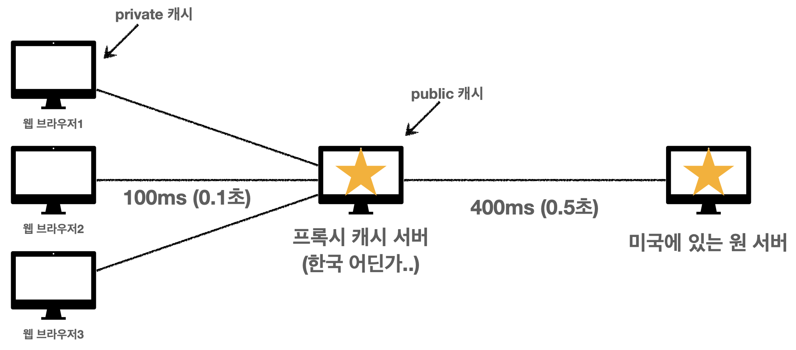

# HTTP 웹 기본지식 강의 정리
# IP (Internet Protocol)

컴퓨터 통신할때 각각 부여받은 출발ip주소, 도착ip주소, 내용 같은 것을  인터넷을 통해 패킷으로 전달

## IP 프로토콜의 한계

- 비연결성
- 비신뢰성
- 프로그램 구분

# TCP UPD

## TCP 특징

전송제어 프로토콜(Transmission Control Protocol)

- 연결지향 - TCP 3 way handshake (가상 연결)
- 데이터 전달 보증
- 순서 보장

- 신뢰할 수 있는 프로토콜
- 현재는 대부분 TCP 사용

## UDP 특징

사용자 데이터그램 프로토콜(User Datagram Protocol)

# PORT

PORT - 같은 IP 내에서 프로세스 구분

- 0 ~ 65535 할당 가능
- 0 ~ 1023: 잘 알려진 포트, 사용하지 않는 것이 좋음

- FTP - 20, 21
- TELNET - 23
- HTTP - 80
- HTTPS - 443

# DNS(Domain Name System)

기억하기 어렵고 바뀔수있는 ip주소를 [aaa.com](http://aaa.com) 같이 이름을 붙혀서 관리

# URI(Uniform Resource Identifier)

- URL - Resource Locator
- URN - Resource Name

# HTTP(Hyper Text Transfer Protocol)

HTTP 메시지에 모든 것을 전송

## HTTP 특징

- 클라이언트 서버 구조
- 무상태 프로토콜(Stateless), 비연결성
    
    웹 어플리케이션 설계할때는 상태유지는 최소한으로 하고, 대부분 무상태로 한다.
    
- HTTP 메시지
    - Start-line
    - Header
    - Body
- 단순함, 확장 가능

## HTTP 메서드

### 리소스와 행위를 분리

가장 중요한 것은 리소스를 식별하는 것

- URI는 리소스만 식별!
- 리소스와 해당 리소스를 대상으로 하는 행위를 분리
    - 리소스: 회원
    - 행위: 조회 , 등록, 삭제, 변경
- 리소스는 명사, 행위는 동사 (미네랄을 캐라)
- 행위(메서드)는 어떻게 구분?

### HTTP 메서드 종류

주요 메서드

- GET: 리소스 조회
- POST: 요청 데이터 처리, 주로 등록에 사용, POST는 무적이다
- PUT: 리소스를 대체, 해당 리소스가 없으면 생성
    - **중요! 클라이언트가 리소스를 식별**
    - 클라이언트가 리소스 위치를 알고 URI 지정
    - POST와 차이점
- PATCH: 리소스 부분 변경
- DELETE: 리소스 삭제

기타 메서드

- HEAD: GET과 동일하지만 메시지 부분을 제외하고, 상태 줄과 헤더만 반환
- OPTIONS: 대상 리소스에 대한 통신 가능 옵션(메서드)를 설명(주로 CORS에서 사용)
- CONNECT: 대상 자원으로 식별되는 서버에 대한 터널을 설정
- TRACE: 대상 리소스에 대한 경로를 따라 메시지 루프백 테스트를 수행

### HTTP 메서드의 속성

- 안전(Safe Methods)
    
    호출해도 리소스를 변경하지 않는다.
    
- 멱등(Idempotent Methods)
    
    몇 번 호출하든 결과가 똑같다.
    
    POST: 멱등이 아니다! 두 번 호출하면 같은 결제가 중복해서 발생할 수 있다.
    
    활용: 자동 복구 메커니즘
    
- 캐시가능(Cacheable Methods)
    - 응답 결과 리소스를 캐시해서 사용해도 되는가?
    - GET, HEAD, POST, PATCH 캐시가능
    - 실제로는 GET, HEAD 정도만 캐시로 사용
        
        POST, PATCH는 본문 내용까지 캐시 키로 고려해야 하는데, 구현이 쉽지 않음
        

## HTTP API 설계 예시

- HTTP API - 컬렉션
    - POST 기반 등록  예) 회원관리 API 제공
- HTTP API - 스토어
    - PUT 기반 등록  예) 정적 컨텐츠 관리, 원격 파일 관리
- HTML FORM 사용
    - 웹 페이지 회원 관리
    - GET, POST만 지원

### 참고하면 좋은 URI 설계 개념

- 문서(document)
    - 단일 개념(파일 하나, 객체 인스턴스, 데이터베이스 row)
    - 예) /members/100, /files/star.jpb
- 컬렉션(collection)
    - 서버가 관리하는 리소스 디렉터리
    - 서버가 리소스의 URI를 생성하고 관리
    - 예) /members
- 스토어(store)
    - 클라이언트가 관리하는 자원 저장소
    - 클라이언트가 리소스의 URI를 알고 관리
    - 예) /files
- 컨트롤러(controller), 컨트롤 URI
    - 문서, 컬렉션, 스토어로 해결하기 어려운 추가 프로세스 실행
    - 동사를 직접 사용
    - 예) /members/{id}/delete
    

## HTTP 상태코드

- 1xx(Informational): 요청이 수신되어 처리중
- 2xx(Successful): 요청 정상 처리
- 3xx(Redirection): 요청을 완료하려면 추가 행동이 필요
    - 영구 리다이렉션
    - 일시 리다이렉션
        - PRG: Post/Redirect/Get
    - 특수 리다이렉션
        - 결과 대신 캐시를 사용
- 4xx(Client Error): 클라이언트 오류, 잘못된 무법등으로 서버가 요청을 수행할 수 없음
- 5xx(Server Error): 서버 오류, 서버가 정상 요청을 처리하지 못함

## HTTP 헤더1 - 일반 헤더

### 협상(콘텐츠 네고시에이션)

클라이언트가 선호하는 표현 요청

### 전송 방식 설명

- 단순 전송
- 압축 전송
- 분할 전송
- 범위 전송

### 일반 정보

**Form**

유저 에이전트의 이메일 정보

- 일반적으로 잘 사용되지 않음
- 갬색 엔진 같은 곳에서, 주로 사용
- 요청에서 사용

**Referer**

이전  웹 페이지 주소

- 현재 요청된 페이지의 이전 웹 페이지 주소
- A → B로 이동하는 경우 B를 요청할 때 Referer: A 를 포함해서 요청
- Referer를 사용해서 유입 경로 분석 가능
- 요청에서 사용
- 참고: referer는 단어 referrer의 오타

**User-Agent**

유저 에이전트 애플리케이션 정보

- Mozilla/5.0 (Macintosh; Intel Mac OS X 10_15_7) AppleWebKit/537.36 (KHTML, like Gecko) Chrome/101.0.4951.64 Safari/537.36
- 클라이언트의 애플리케이션 정보(웹 브라우저 정보, 등등)
- 통계 정보
- 어떤 종류의 브라우저에서 장애가 발생하는지 파악 가능
- 요청에서 사용

**Server**

요청을 처리하는 ORIGIN 서버의 소프트웨어 정보

- Server: Apache/2.2.22 (Debian)
- server: nginx
- 응답에서 사용

**Date**

메시지가 발생한 날짜와 시간

- Date: Fri, 20 May 2022 10:29:03 GMT
- 응답에서 사용

### 특별한 정보

**Host (필수!)**

요청한 호스트 정보(도메인)

**Location**

페이지 리다이렉션

**Allow**

허용 가능한 HTTP 메서드

**Retry-After**

유저 에이전트가 다음 요청을 하기까지 기다려야 하는 시간

### 인증

### 쿠키⭐(중요!)

- Set-Cookie
- Cookie

## HTTP 헤더2 - 캐시와 조건부 요청

**HTTP Cache (Web Cache)** : 서버 지연 줄이기 위해 웹 문서들을 임시 저장하기 위한 정보기술

**캐시 기본동작**

1. 웹브라우저가 요청하면  서버에서 cache-control ****: max-age=60 처럼 Header에 추가해 응답
2. 브라우저가 응답결과를 브라우저 캐시에 저장
3. 두번째 요청부터는 브라우저캐시에서 캐시 유효시간 검증을 하여 유효하면 브라우저 캐시에서 문서를 조회

*캐시 유효시간 초과시: 서버를 통해 데이터를 다시 조회하고, 캐시를 갱신

*단점: 이 때 다시 네트워크 다운로드가 발생

→이걸 **검증헤더, 조건부 요청**으로 해결

**검증헤더(Validator), 조건부 요청 헤더**

- 캐시 유효시간이 초과해도 서버의 데이터가 갱신되지 않으면
    
    304 Not Modified + Header 메타정보만 응답(Body X)
    
- last-modified : 데이터가 마지막으로 수정된 시간(서버에서 응답)
    
    ex) ****Thu, 30 Sep 2021 06:18:00 GMT
    
- if-modified-since : 서버로부터 last-modified 에 설정된 시간을 브라우저 캐시에 저장하고 있다가 캐시유효시간이 끝나면 다시 요청할때 if-modified-since : last-modified 값 을 추가해서 전송
    
    ex) ****Thu, 30 Sep 2021 06:18:00 GMT
    
- if-modified-since 와 last-modified 시간이 같으면 데이터가 수정되지 않은걸로 판단
    
    → 304 Not Modified + Header 메타정보만 응답(Body X)
    

결과적으로 네트워크 다운로드가 발생하지만 용량이적은 Header 정보만 다운로드

*단점: 이 방법은 1초미만 단위로 캐시 조정이 불가능,

날짜가 다르지만 원래 데이터와 수정한 데이터 결과가 같은경우 다시 데이터 다운로드 받아야함

서버에서 별도의 캐시 로직을 관리하고 싶은 경우 불가능

ex) 스페이스나 주석처럼 크게 영향이없는 변경에서 캐시를 유지하고 싶은경우

→ **ETag(Entity Tag), If-None-Match** 해결가능

**ETag(Entity Tag)**

- 캐시용 데이터에 임의의 고유한 버전 이름을 달아둠
- 데이터가 변경되면 이 이름을 바꾸어서 변경함(Hash를 다시 생성)
- 요약 : ETag만 보내서 같으면 유지, 다르면 다시받기
- **캐시 제어 로직을 서버에서 완전히 관리** ⭐

**If-None-Match**

- if-modified-since 같이 ETag 값을 요청할때 보냄
- 일치하면 304 Not Modified + Header 메타정보만 응답(Body X)

### 캐시 제어 헤더

- Cache-Control : 캐시 제어
    
    캐시 지시어(directives)
    
    - Cache-Control: max-age
        - 캐시 유효 시간 (초단위)
    - Cache-Control: no-cache
        - 데이터는 캐시해도 되지만, 항상 원(origin) 서버에 검증하고 사용
    - Cache-Control: no-store
        - 데이터에 민감한 정보가 있으므로 저장하면 안됨
            
            (메모리에서 사용하고 최대한 빨리 삭제)
            
- Pragma : 캐시 제어(하위 호환)
    - Pragma: no-cache
    - HTTP 1.0 하위 호환
- Expires : 캐시 유효 기간(하위 호환)
    
    캐시 만료일 지정(하위 호환)
    
    - expires: Mon, 01 Jan 1990 00:00:00 GMT
    - 캐시 만료일을 정확한 날짜로 지정
    - HTTP 1.0 부터 사용
    - 지금은 더 유연한 Cache-Control: max-age 권장
    - Cache-Control: max-age와 함께 사용하면 Expires는 무시
    

### 정리

**검증 헤더** 

- ETag: “v2.0”, ETag: “asddf122dd2k”
- Last-Modified: Thu, 04 Jun 2020 07:19:24 GMT

**조건부 요청 헤더**

- If-Match, If-None-Match: ETag 값 사용
- If-Modified-Since, If-Unmodified-Since: Last-Modified 값 사용

### 프록시 서버

- 프록시(Proxy): 서버와 클라이언트 사이에 중계기로서 대리로 통신을 수행하는 것
- 프록시 서버: 그 중계 기능을 하는 것을 프록시 서버라고 부른다.

> 프록시 서버 중 일부는 프록시 서버에 요청된 내용들을 [캐시](https://ko.wikipedia.org/wiki/%EC%BA%90%EC%8B%9C)
를 이용하여 저장해 둔다. 이렇게 캐시를 해 두고 난 후에, 캐시 안에 있는 정보를 요구하는 요청에 대해서는 원격 서버에 접속하여 데이터를 가져올 필요가 없게 됨으로써 전송 시간을 절약할 수 있게 됨과 동시에 불필요하게 외부와의 연결을 하지 않아도 된다는 장점을 갖게 된다.
> 

**Cache-Control**

**캐시 지시어(directives)**

- Cache-control: public
    
    응답이 public 캐시에 저장되어도 됨
    
- Cache-Control: private
    
    응답이 해당 사용자만을 위한 것임, private 캐시에 저장해야 함(기본값)
    
- Cache-Control: s-maxage
    
    프록시 캐시에만 적용되는 max-age
    
- Age: 60 (HTTP 헤더)
    
    오리진 서버에서 응답 후 프록시 캐시 내에 머문 시간(초)
    

### 캐시무효화 필요한 이유?

캐시를 적용하지 않는다고 해서 캐시가 안되는것이 아니다. 

웹브라우저에서 임의로 캐시를 할수도있다.

**Cache-Control**

**캐시 지시어(directives) - 확실한 캐시 무효화 응답 예시**

> Cache-Control: no-cache, no-store, must-revalidate
> 

> Pragma: no-cache ← HTTP 1.0 하위 호환
> 

- Cache-Control: must-revalidate
    
    캐시 만료후 최조 조회시 **원 서버에 검증**해야함
    
    원 서버 접근 실패시 반드시 오류가 발생해야함 - 504(Gateway TImeout)
    
    must-revalidate는 캐시 유효 시간이라면 캐시를 사용함
